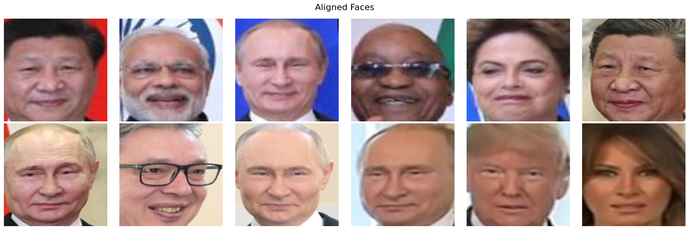
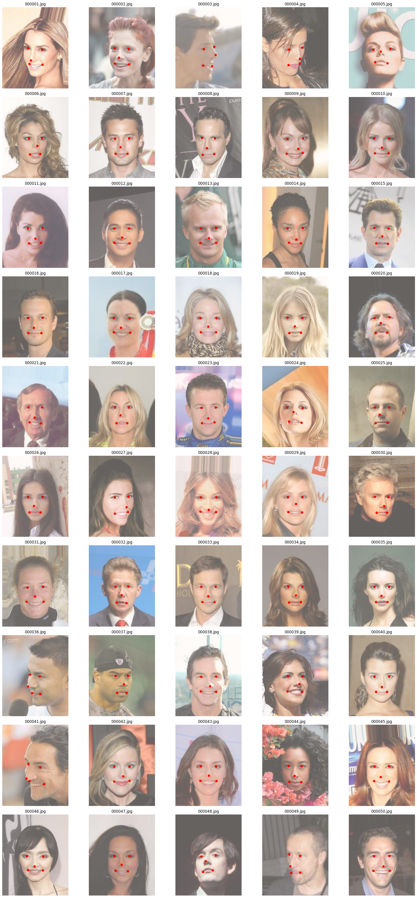
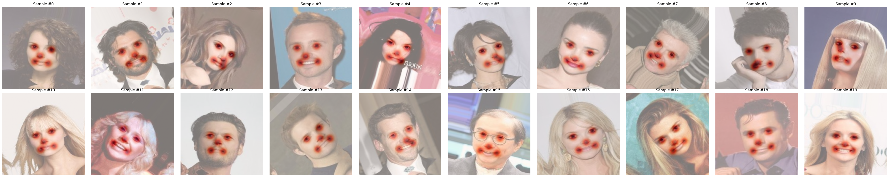
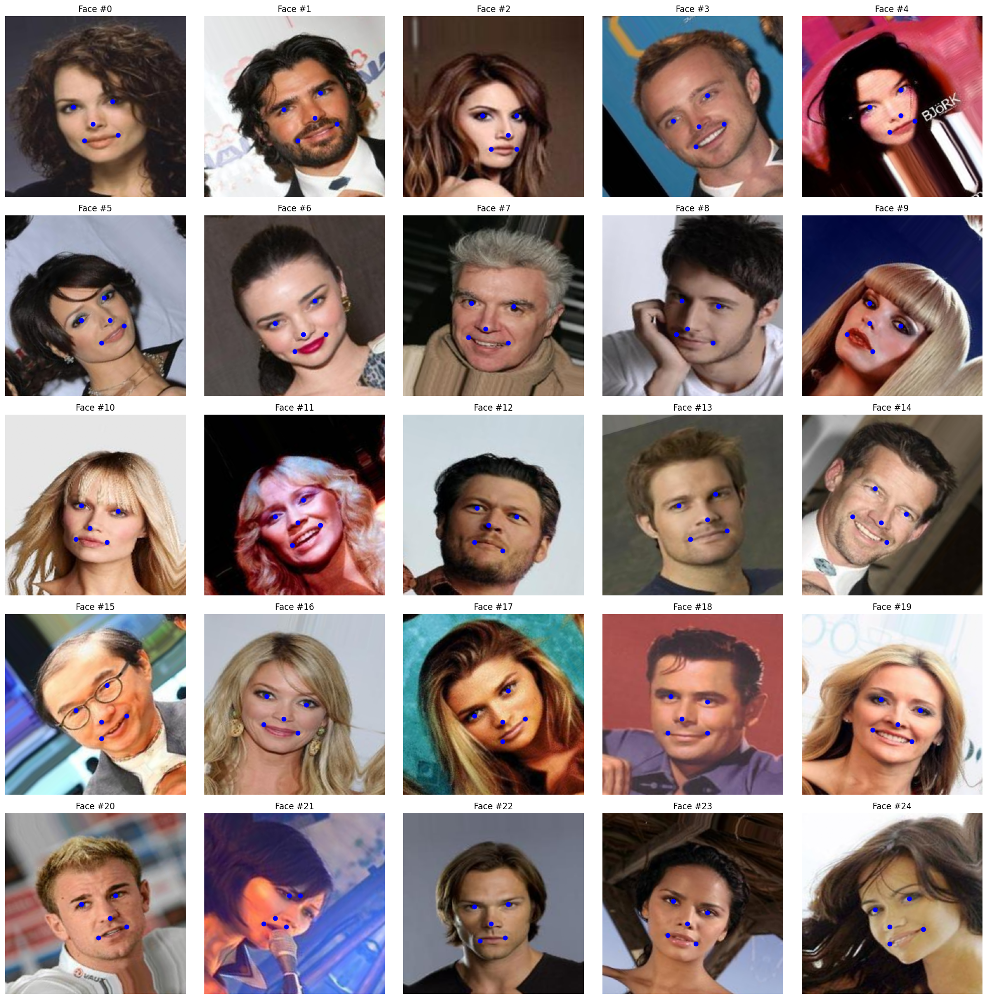
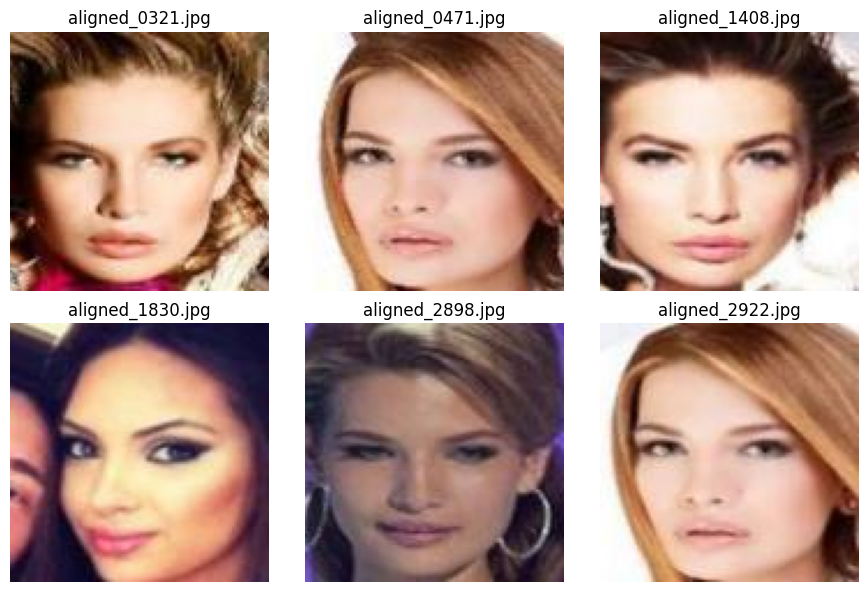
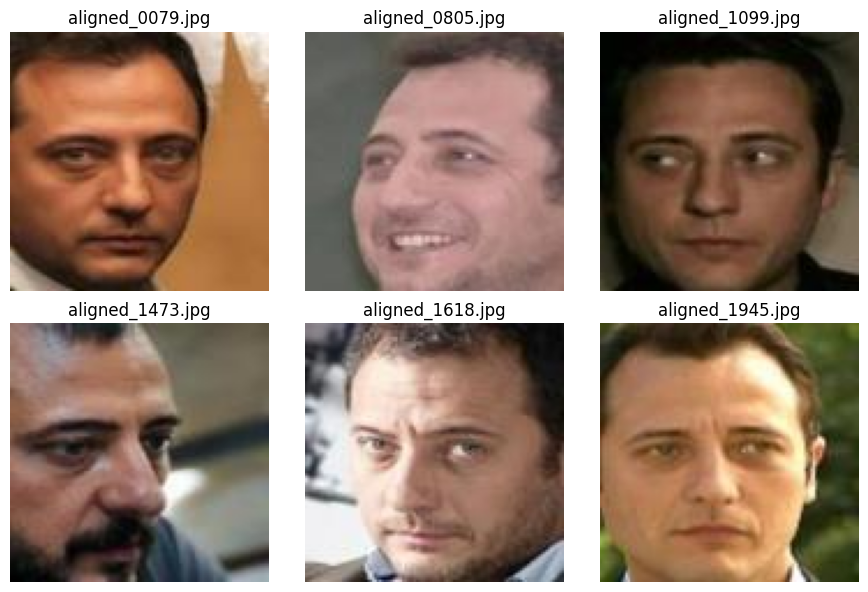
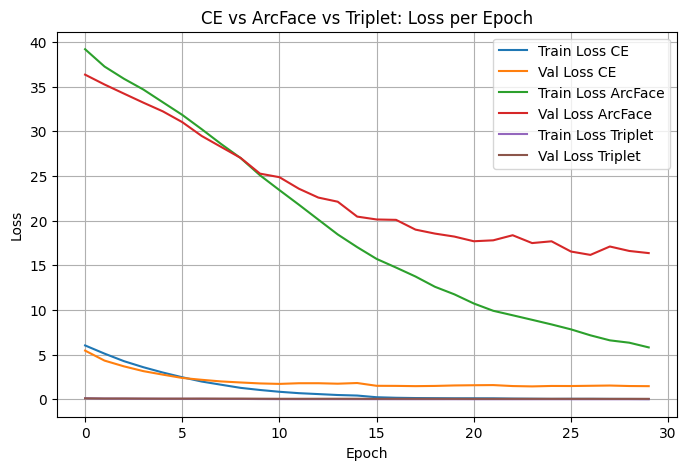
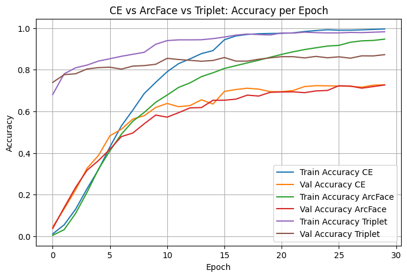
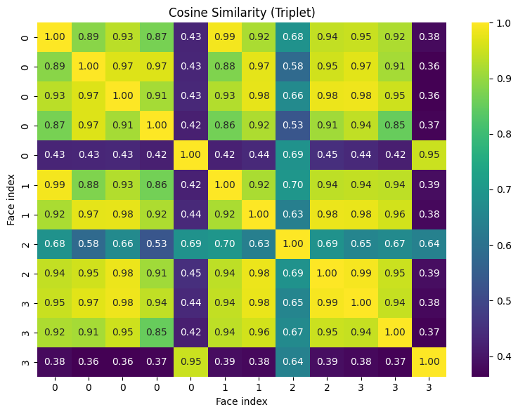

# Face Recognition Pipeline

Исследовательский ML/CV-проект на PyTorch: полный end-to-end pipeline распознавания лиц — от facial landmark detection и face alignment до metric learning, embedding analysis и verification-style evaluation (`TPR@FPR`).

Проект реализован без использования pretrained face-recognition моделей.
Использовались только:

  ImageNet initialization для backbone;
  pretrained face detector (MTCNN) для первого этапа пайплайна.

Все embedding-модели обучались самостоятельно под задачу face recognition.





## Highlights

- Full end-to-end face recognition pipeline
- Stacked Hourglass landmark detector
- 5 facial landmarks + face alignment
- CrossEntropy / ArcFace / Triplet / Hybrid losses
- Triplet Loss: **0.8723 validation accuracy**
- Identification Rate evaluation (`TPR@FPR`)
- Open-set evaluation on unseen identities
- Reproducible CLI pipeline + tests

## Situation

Большинство учебных face recognition проектов заканчиваются обучением классификатора на уже выровненных лицах. В реальных системах этого недостаточно: качество embedding-пространства напрямую зависит от стабильности landmark detection и alignment.

Целью проекта было не просто обучить CNN-классификатор, а построить полноценный face recognition pipeline:

- facial landmark detection;
- face alignment;
- embedding extraction;
- metric learning;
- verification-style evaluation на unseen identities.

Дополнительная сложность заключалась в самом датасете CelebA: лица в нем уже выровнены. Без дополнительных аугментаций landmark detector быстро переобучается на “идеальные” изображения и плохо переносится на реальные фотографии с наклонами, поворотами головы, частичными перекрытиями и сложной геометрией лица.

## Task

Требовалось:

- реализовать и обучить Stacked Hourglass Network для предсказания facial landmarks;
- реализовать alignment по ключевым точкам;
- обучить несколько face recognition моделей с различными loss-функциями;
- сравнить closed-set и open-set сценарии распознавания;
- реализовать Identification Rate metric (TPR@FPR);
- собрать воспроизводимый inference pipeline;
- провести сравнение с open-source face recognition библиотеками.

## Action

### Facial Landmark Detection

Для локализации ключевых точек была реализована Stacked Hourglass Network на основе статьи:

  Newell et al., Stacked Hourglass Networks for Human Pose Estimation, 2016

Модель предсказывает 5 facial landmarks:

- левый глаз;
- правый глаз;
- нос;
- левый угол рта;
- правый угол рта.



**Ключевая проблема: CelebA already aligned**

Если обучать landmark detector напрямую на исходном CelebA, модель быстро переучивается на идеально выровненные лица и плохо переносится на реальные фотографии.

Чтобы избежать этого, были реализованы синхронные image+landmark аугментации:

- повороты до ±45°;
- affine transforms;
- масштабирование;
- сдвиги;
- синхронные преобразования изображений и keypoints.

Это позволило приблизить train distribution к реальным изображениям и значительно улучшило устойчивость модели.



Для обучения:

- изображения ресайзились до 256×256;
- heatmaps создавались в размере 64×64;
- использовался MSELoss;
- применялся ReduceLROnPlateau.

| Параметр | Значение |
|---|---|
| num_stacks | 2 |
| num_blocks | 4 |
| channels | 128 |
| num_keypoints | 5 |

Модель обучалась 70 эпох и достигла стабильного val_loss ≈ 0.0011.

**Качественный анализ**

Проводился qualitative analysis ошибок landmark detector.

Наиболее сложными оказались:

- профильные лица;
- экстремальные наклоны головы;
- микрофоны рядом с лицом;
- очки;
- волосы, закрывающие глаза;
- частичные перекрытия.

Несмотря на это, модель сохраняла стабильную локализацию ключевых точек даже на сложных изображениях.



### Face Alignment

После предсказания landmarks реализован этап face alignment.

Для выравнивания:

- использовался similarity/affine transform;
- применялся шаблон 5 ключевых точек из InsightFace;
- выполнялось нормализованное приведение лиц к размеру 112×112.



Ключевая идея проекта:

  качество face recognition зависит не только от classifier head, но и от стабильности геометрии alignment.

Ошибки в landmarks ухудшают alignment, а плохой alignment напрямую разрушает embedding-space separability.

### Face Recognition Models

После alignment были обучены embedding-модели на базе ResNet50.

Сравнивались следующие подходы:

| Подход | Идея |
|---|---|
| CrossEntropy | closed-set classification baseline |
| ArcFace | angular margin loss |
| CE + ArcFace | hybrid classification + angular margin |
| Triplet Loss | metric learning |
| ArcFace + Triplet | combined metric + angular learning |

### CrossEntropy

Базовая модель обучалась через CrossEntropyLoss.

Особенности:

- pretrained ImageNet backbone;
- classification head на 500 identities;
- standard closed-set training.

**Результат**

| Метрика | Значение |
|---|---:|
| Validation Accuracy | 0.7277 |

CrossEntropy быстро сходился и достигал почти 100% train accuracy, однако начинал демонстрировать признаки переобучения после ~15 эпох.

### ArcFace

Далее был реализован ArcFace Loss.

В отличие от обычной CrossEntropy:

- эмбеддинги и веса классов нормализуются;
- используется angular margin;
- формируется более структурированное embedding-space.

Использовались параметры из оригинальной статьи:

- s = 64
- m = 0.5

**Результат**

| Метрика | Значение |
|---|---:|
| Validation Accuracy | 0.7267 |

ArcFace обучался стабильнее и формировал более разделимые embeddings, но не дал прироста accuracy на ограниченном числе identity.

### Triplet Loss

Для metric learning был реализован отдельный triplet pipeline.

Был создан специальный TripletDataset, который формировал:

- anchor;
- positive;
- negative.

**Важный инженерный момент**

Для Triplet Loss использовались минимальные аугментации:

- Resize;
- ToTensor.

Сильные аугментации ухудшали качество triplet mining, потому что positive samples начинали становиться менее похожими на anchor.

**Результат**

| Метрика | Значение |
|---|---:|
| Validation Accuracy | **0.8723** |

Triplet Loss оказался лучшим по closed-set classification accuracy и продемонстрировал наиболее качественную separability embedding space.

<p align="center">
  
  
</p>

### Hybrid Losses

Дополнительно исследовались смешанные loss-функции:

- CrossEntropy + ArcFace;
- ArcFace + Triplet.

Был реализован собственный ArcFaceTripletLoss, объединяющий:

- angular margin optimization;
- metric learning;
- triplet separation.

Также исследовалось dynamic triplet mining внутри batch.

Интересный вывод:

  заранее подготовленный TripletDataset оказался эффективнее dynamic triplet generation внутри batch.

### Full Inference Pipeline

Был реализован полноценный inference pipeline:

  raw image
    -> face detector (MTCNN)
    -> landmark detector (Stacked Hourglass)
    -> face alignment
    -> embedding extraction
    -> cosine similarity / nearest search
    -> identification / verification

Pipeline поддерживает:

- batch inference;
- alignment;
- embedding extraction;
- nearest identity search;
- gallery-based retrieval.

Реализация находится в:

  src/face_recognition/pipeline.py

**Почему accuracy недостаточна**

Обычная classification accuracy измеряет качество только на identity, присутствующих в train/val.

Для более реалистичной оценки была реализована Identification Rate metric (TPR@FPR) на unseen identities.

Для этого:

- формировались query/distractor splits;
- считались positive и negative пары;
- фиксировался допустимый FPR;
- вычислялся TPR при заданном threshold.

Такой сценарий гораздо ближе к реальным face verification/retrieval системам.

## Result

| Model | Validation Accuracy |
|---|---:|
| CrossEntropy | 0.7277 |
| ArcFace | 0.7267 |
| Triplet Loss | **0.8723** |
| CE + ArcFace | 0.7307 |
| ArcFace + Triplet 1:1 | 0.7437 |
| ArcFace + Triplet 2:1 | 0.7417 |

| Model | FPR=0.50 | FPR=0.20 | FPR=0.10 | FPR=0.05 |
|---|---:|---:|---:|---:|
| CE | **0.8678** | **0.5805** | **0.3858** | **0.2431** |
| ArcFace | 0.6393 | 0.2936 | 0.1677 | 0.0976 |
| Triplet | 0.7215 | 0.3877 | 0.2285 | 0.1333 |
| CE + ArcFace | 0.7172 | 0.3668 | 0.2127 | 0.1282 |
| ArcFace + Triplet | 0.7192 | 0.3587 | 0.1991 | 0.1112 |


### Главный вывод экспериментов

Интересный результат экспериментов:

> лучшая validation accuracy не совпала с лучшей verification-метрикой.

## Unexpected Result

Triplet Loss показал лучшую validation accuracy (`0.8723`), однако CrossEntropy неожиданно оказался лучшим по open-set Identification Rate (`TPR@FPR`) на unseen identities.

Это демонстрирует фундаментальное различие между:

- closed-set classification;
- open-set face verification.

Triplet лучше структурировал embedding-space внутри обучающих identity, но CrossEntropy показал более устойчивое поведение при TPR@FPR evaluation на unseen identities.

### Анализ embedding space

Для оценки качества embeddings проводились:

- cosine similarity analysis;
- L2 distance analysis;
- similarity heatmaps;
- top-k retrieval comparisons.

Triplet Loss продемонстрировал наиболее выраженную блочную структуру similarity matrix и корректно находил все пары одинаковых лиц на тестовых изображениях.



### Основные ML-инсайты

- Alignment quality напрямую влияет на separability embedding space.
- CelebA already aligned → без сильных аугментаций landmark detector плохо переносится на реальные фото.
- Validation accuracy недостаточна для оценки face recognition pipeline.
- Closed-set classification и open-set verification требуют разных метрик.
- Triplet Loss оказался сильнее для embedding separation внутри train distribution.
- CrossEntropy неожиданно показал лучший TPR@FPR на unseen identities.
- Dynamic triplet mining внутри batch дал худшие результаты, чем заранее подготовленный triplet dataset.
- ArcFace оказался чувствителен к числу identity и гиперпараметрам margin/scale.

## Что реализовано

- Stacked Hourglass Network для facial landmark detection.
- Heatmap-based landmark localization.
- Face alignment через affine/similarity transform.
- Подготовка aligned faces.
- Embedding extraction pipeline.
- CrossEntropy / ArcFace / Triplet / Hybrid losses.
- ArcFaceTripletLoss.
- Identification Rate (TPR@FPR).
- Query/distractor evaluation.
- Cosine similarity retrieval.
- Full inference pipeline.
- CLI scripts для training/evaluation/inference.
- Reusable src/face_recognition package.
- Unit tests для alignment и IR metric.

## External Libraries Research

Дополнительно были протестированы:

- DeepFace;
- InsightFace;
- face_recognition / dlib.

Цель — sanity-check и comparison baseline.

Основной вывод:

- InsightFace и DeepFace показали стабильную работу и GPU-friendly inference;
- face_recognition/dlib продемонстрировал проблемы совместимости с Colab и сложную сборку.

При этом финальные результаты проекта получены без использования pretrained face-recognition моделей.


## Структура репозитория

```text
.
├── README.md
├── requirements.txt
├── pyproject.toml
├── .gitignore
├── notebooks/
│   └── legacy/                 # исходные исследовательские ноутбуки
├── src/face_recognition/
│   ├── alignment.py
│   ├── datasets.py
│   ├── losses.py
│   ├── metrics.py
│   ├── pipeline.py
│   ├── models/
│   │   ├── embedding.py
│   │   └── hourglass.py
│   └── utils/visualization.py
├── scripts/
│   ├── train_hourglass.py
│   ├── train_classifier.py
│   ├── align_faces.py
│   ├── run_pipeline.py
│   ├── prepare_ir_split.py
│   └── evaluate_ir.py
├── assets/
│   ├── readme/                 # отобранные изображения для README
│   └── notebook_exports/        # остальные экспортированные графики
├── data/                       # только README/.gitkeep в git
├── checkpoints/                # только README/.gitkeep в git
└── docs/
```

## Как запустить

Установить зависимости:

```bash
python3.11 -m venv .venv
source .venv/bin/activate
python -m pip install --upgrade pip
pip install -r requirements.txt
pip install -e .
```

Для research notebooks и сравнения с DeepFace/InsightFace зависимости ставятся отдельно:

```bash
pip install -r requirements-research.txt
```

Посмотреть сохраненную IR-таблицу:

```bash
python scripts/evaluate_ir.py
```

Обучить Stacked Hourglass landmark detector на CSV-разметке:

```bash
python scripts/train_hourglass.py \
  --images-dir data/raw/img_align_celeba \
  --annotations data/raw/landmarks.csv \
  --epochs 20 \
  --checkpoint-out checkpoints/hourglass_best.pth
```

Обучить классификатор лиц:

```bash
python scripts/train_classifier.py \
  --data-dir data/aligned/train \
  --val-dir data/aligned/val \
  --loss ce \
  --epochs 30 \
  --output-dir checkpoints
```

Обучить Triplet-модель:

```bash
python scripts/train_classifier.py \
  --data-dir data/aligned/train \
  --val-dir data/aligned/val \
  --loss triplet \
  --epochs 30 \
  --output-dir checkpoints
```

Посчитать Identification Rate для checkpoint:

```bash
python scripts/evaluate_ir.py \
  --checkpoint checkpoints/best_triplet.pth \
  --query-dir data/eval/query \
  --distractor-dir data/eval/distractors
```

## Что можно улучшить

- Добавить единый конфиг экспериментов и логирование в CSV/MLflow/W&B.
- Вынести подготовку CelebA и alignment в отдельный reproducible script.
- Добавить hard negative mining для Triplet Loss.
- Проверить ArcFace на большем числе identity и более длинном обучении.
- Добавить тесты для alignment, метрик и загрузчиков данных.
- Сохранить легкие demo-assets вместо полных notebook outputs.

## Итог

Проект эволюционировал из набора исследовательских ноутбуков в полноценный reproducible face recognition pipeline.

В ходе работы были реализованы:

- landmark localization;
- face alignment;
- metric learning;
- verification-style evaluation;
- embedding analysis;
- inference pipeline;
- research comparison разных loss-функций.

Главный вывод экспериментов:

> качество face recognition определяется не только backbone-моделью, но и всей геометрией пайплайна — от landmark detection до структуры embedding space и способа evaluation.
