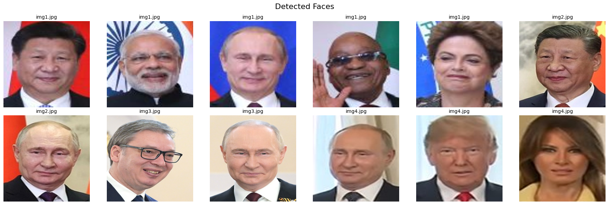
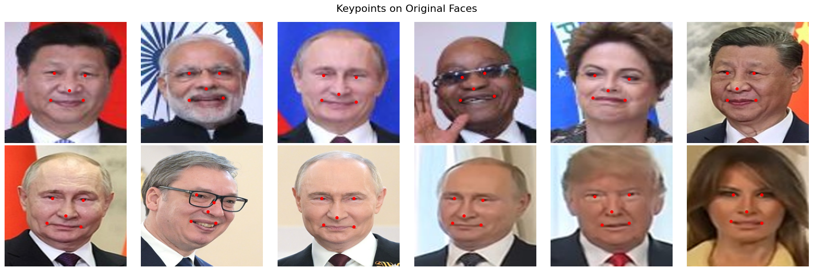
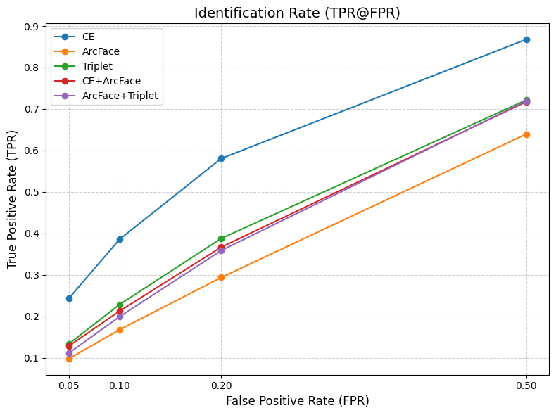
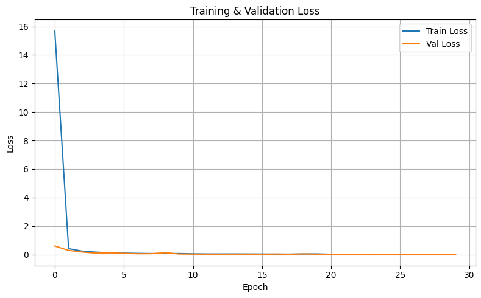
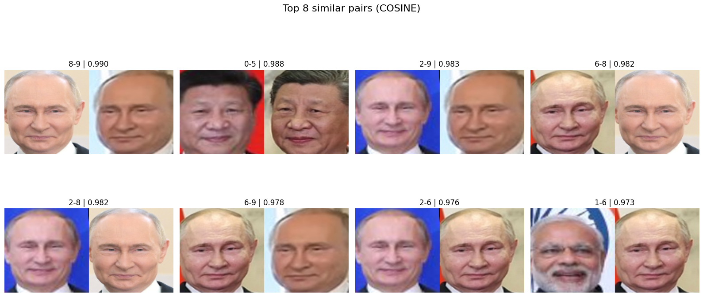

# Face Recognition Pipeline

Учебно-исследовательский ML/CV-проект на PyTorch: пайплайн распознавания лиц от предсказания facial landmarks и alignment до обучения embedding-моделей, сравнения loss-функций и verification-style оценки через Identification Rate. Проект не использует pretrained face-recognition модели; ImageNet backbone применялся только как стартовая инициализация CNN.



## Situation

После серии экспериментов в Colab проект накопил несколько ноутбуков, промежуточные веса, архивы датасетов и разрозненные визуализации. При этом внутри уже была полноценная исследовательская работа: landmark detector, face alignment, классификация лиц, metric learning и отдельная оценка на unseen identities.

## Task

Цель проекта — собрать аккуратный end-to-end face recognition pipeline, который показывает не только финальную accuracy, но и инженерную логику решения: подготовку лиц, обучение разных моделей, сравнение функций потерь и проверку качества в сценарии, близком к verification/retrieval.

## Action

Был реализован Stacked Hourglass Network для пяти ключевых точек лица: левый глаз, правый глаз, нос, левый угол рта и правый угол рта. По предсказанным landmarks выполняется similarity alignment, после чего выровненные лица используются для обучения классификатора и embedding-моделей.

Дальше были обучены и сравнены несколько подходов: CrossEntropy, ArcFace, Hybrid loss и Triplet Loss. Для честной проверки обобщения добавлена Identification Rate / TPR@FPR оценка на query и distractor наборах, состоящих из identity, не использованных при обучении.



## Result

В классификационном эксперименте по validation accuracy лучшим оказался Triplet-подход: около `0.87`, тогда как CE, ArcFace и Hybrid держались около `0.72-0.74`. Эти значения подтверждаются исследовательским ноутбуком `notebooks/legacy/Faces_CE_72_ArcFace_73_Hybrid_73_Triplet_85.ipynb`.

В отдельной verification-style оценке через Identification Rate лучшей стала CE-модель при `TPR@FPR=0.50`: `0.8678`. Triplet в этой метрике дал `0.7215`, ArcFace — `0.6393`, CE+ArcFace — `0.7172`, ArcFace+Triplet — `0.7192`. Поэтому в проекте явно разделены две метрики: validation accuracy для закрытой классификации и IR для открытого набора identity.



## Что реализовано

- Stacked Hourglass Network для предсказания facial landmarks.
- Face alignment по пяти ключевым точкам через affine/similarity transform.
- Подготовка aligned faces для последующего распознавания.
- Обучение классификатора лиц на выровненных изображениях.
- Embedding-модели и сравнение CrossEntropy, ArcFace, Hybrid и Triplet Loss.
- Identification Rate / TPR@FPR для verification-style evaluation.
- CLI-скрипты для обучения landmark detector, классификатора, batch alignment, full pipeline inference и IR-оценки.

## Архитектура пайплайна

```text
raw image
  -> facial landmark detector (Stacked Hourglass)
  -> five keypoints
  -> face alignment
  -> aligned face crop
  -> CNN encoder / embedding model
  -> cosine similarity / classifier logits
  -> identification or verification-style decision
```

Ключевая идея: качество распознавания зависит не только от classifier head, но и от стабильности предобработки. Ошибка в landmarks ухудшает alignment, а плохой alignment напрямую портит embedding-пространство.

## Модели и loss-функции

`StackedHourglassNet` предсказывает heatmaps ключевых точек. Для распознавания используется ResNet50-based encoder с L2-normalized embedding head и optional classification head. Полный inference слой собран в [`src/face_recognition/pipeline.py`](src/face_recognition/pipeline.py): он загружает landmark model, выравнивает лица, извлекает embeddings и при наличии gallery выполняет nearest identity search.

| Подход | Роль в эксперименте |
|---|---|
| CrossEntropy | сильный baseline для закрытой классификации identity |
| ArcFace | angular margin loss для более разделимых embeddings |
| CE + ArcFace | гибрид классификационного и angular-margin обучения |
| Triplet Loss | metric learning: anchor ближе к positive, дальше от negative |
| ArcFace + Triplet | комбинированный эксперимент margin-based и metric learning |



## Метрики

Использовались две группы метрик:

- validation accuracy / top-k accuracy для классификации известных identity;
- Identification Rate, то есть `TPR@FPR`, для проверки качества на unseen identity с query/distractor split.

Identification Rate важнее обычной accuracy для открытого сценария face recognition: модель должна работать с людьми, которых не было в train/val, а не только выбирать один из известных классов.

## Результаты

Классификационное сравнение из ноутбуков:

| Model | Validation accuracy |
|---|---:|
| CrossEntropy | 0.7277 |
| ArcFace | 0.7267 |
| Triplet Loss | 0.8723 |
| CE + ArcFace | 0.7307 |
| ArcFace + Triplet 1:1 | 0.7437 |
| ArcFace + Triplet 2:1 | 0.7417 |

Identification Rate / TPR@FPR:

| Model | FPR=0.50 | FPR=0.20 | FPR=0.10 | FPR=0.05 |
|---|---:|---:|---:|---:|
| CE | **0.8678** | **0.5805** | **0.3858** | **0.2431** |
| ArcFace | 0.6393 | 0.2936 | 0.1677 | 0.0976 |
| Triplet | 0.7215 | 0.3877 | 0.2285 | 0.1333 |
| CE + ArcFace | 0.7172 | 0.3668 | 0.2127 | 0.1282 |
| ArcFace + Triplet | 0.7192 | 0.3587 | 0.1991 | 0.1112 |



## Структура репозитория

```text
.
├── README.md
├── requirements.txt
├── pyproject.toml
├── .gitignore
├── notebooks/
│   ├── *_Clean.ipynb           # очищенные исследовательские ноутбуки
│   └── legacy/                 # дополнительные исходные эксперименты
├── src/face_recognition/
│   ├── alignment.py
│   ├── datasets.py
│   ├── losses.py
│   ├── metrics.py
│   ├── pipeline.py
│   ├── models/
│   │   ├── embedding.py
│   │   └── hourglass.py
│   └── utils/visualization.py
├── scripts/
│   ├── train_hourglass.py
│   ├── train_classifier.py
│   ├── align_faces.py
│   ├── run_pipeline.py
│   ├── prepare_ir_split.py
│   └── evaluate_ir.py
├── assets/
│   └── readme/                 # отобранные изображения для README
├── data/                       # только README/.gitkeep в git
├── checkpoints/                # только README/.gitkeep в git
└── docs/
```

## Как запустить

Установить зависимости:

```bash
python3.11 -m venv .venv
source .venv/bin/activate
python -m pip install --upgrade pip
pip install -r requirements.txt
pip install -e .
```

Для research notebooks и сравнения с DeepFace/InsightFace зависимости ставятся отдельно:

```bash
pip install -r requirements-research.txt
```

Для локальных проверок кода:

```bash
pip install -r requirements-dev.txt
ruff check src scripts tests
pyflakes src scripts tests
pytest -q
```

Посмотреть сохраненную IR-таблицу:

```bash
python scripts/evaluate_ir.py
```

Обучить Stacked Hourglass landmark detector на CSV-разметке:

```bash
python scripts/train_hourglass.py \
  --images-dir data/raw/img_align_celeba \
  --annotations data/raw/landmarks.csv \
  --epochs 20 \
  --checkpoint-out checkpoints/hourglass_best.pth
```

Обучить классификатор лиц:

```bash
python scripts/train_classifier.py \
  --data-dir data/aligned/train \
  --val-dir data/aligned/val \
  --loss ce \
  --epochs 30 \
  --output-dir checkpoints
```

Обучить Triplet-модель:

```bash
python scripts/train_classifier.py \
  --data-dir data/aligned/train \
  --val-dir data/aligned/val \
  --loss triplet \
  --epochs 30 \
  --output-dir checkpoints
```

Посчитать Identification Rate для checkpoint:

```bash
python scripts/evaluate_ir.py \
  --checkpoint checkpoints/best_triplet.pth \
  --query-dir data/eval/query \
  --distractor-dir data/eval/distractors
```

## External libraries

В отдельном исследовательском ноутбуке проверялись DeepFace, InsightFace и `face_recognition`/dlib. Это sanity-check и research baseline, а не часть основного результата: финальные метрики проекта получены без pretrained face-recognition моделей. Эти библиотеки не входят в core install и ставятся через `requirements-research.txt`. Подробности вынесены в [`docs/external_libraries.md`](docs/external_libraries.md).

## Notebook coverage

| Notebook | Что покрыто в репозитории | Что осталось notebook-only |
|---|---|---|
| `1_StackedHourGlassNetwork_Clean.ipynb` | Stacked Hourglass, landmark extraction, alignment, training CLI | подробные аугментационные эксперименты и визуальный анализ |
| `2_AllModels_Clean (1).ipynb` | CE, ArcFace, Hybrid, Triplet, ArcFace+Triplet losses и classifier training CLI | t-SNE, confusion matrix и расширенные графики обучения |
| `3_FaceRecognitionPipeline_Clean.ipynb` | `pipeline.py`, batch/full inference CLI, cosine/nearest search | ручная демонстрация на отдельных фото |
| `4_Identification_Rate_Metric_Clean.ipynb` | `compute_ir`, `evaluate_ir.py`, `prepare_ir_split.py` | подробная пошаговая сборка query/distractor из Colab |
| `5_BiblioTest_Clean.ipynb` | краткое описание external baselines в docs | код запуска DeepFace/InsightFace/dlib |
| `README (1).ipynb` | STAR README и ключевые результаты | старые Google Drive ссылки и base64-outputs |

## Что можно улучшить

- Добавить единый конфиг экспериментов и логирование в CSV/MLflow/W&B.
- Вынести подготовку CelebA и alignment в отдельный reproducible script.
- Добавить hard negative mining для Triplet Loss.
- Проверить ArcFace на большем числе identity и более длинном обучении.
- Добавить тесты для alignment, метрик и загрузчиков данных.
- Сохранить легкие demo-assets вместо полных notebook outputs.
